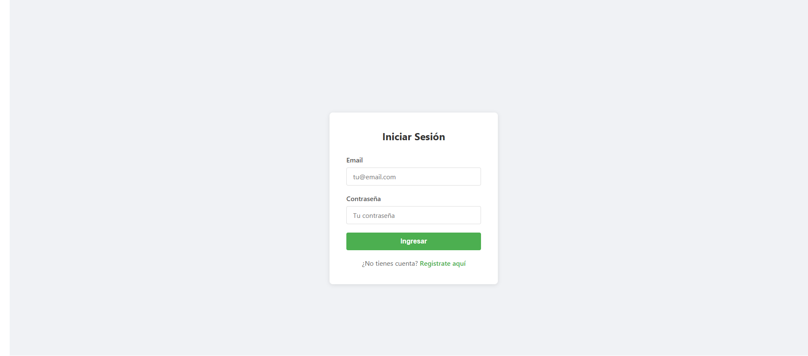
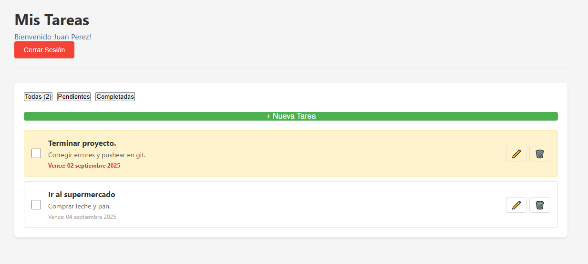
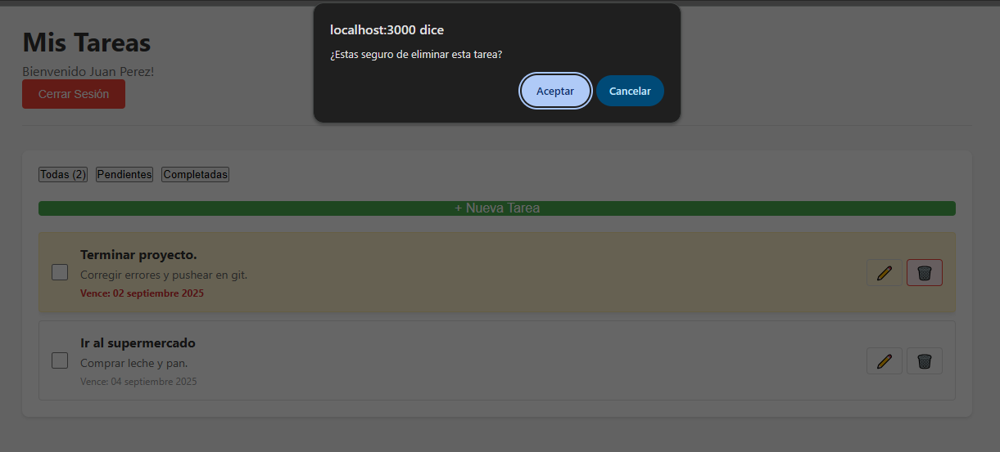

# Sistema de Gestión Personal

## Descripción
Una aplicación web para gestionar tareas diarias, notas y recordatorios de manera eficiente.

## Estado del Proyecto
🚧 **FINALIZADO [4/9/2025]** - Iniciado el [24/8/2025]

## Características

### MVP (Mínimo Producto Viable)
- [x] Sistema de registro/login de usuarios
- [x] CRUD de tareas (crear, leer, actualizar, eliminar)
- [x] Marcar tareas como completadas
- [x] Filtrar tareas por estado

### Futuras mejoras
- [ ] Sistema de notas
- [ ] Recordatorios con notificaciones
- [ ] Categorías personalizadas
- [ ] Estadísticas de productividad

## Tecnologías a utilizar

### Backend
- **Node.js**
- **Express.js**
- **MongoDB**
- **JWT para autenticación**

### Frontend
- **React**
- **CSS**
- **Axios para peticiones HTTP**

## Instalación y Uso

### Prerrequisitos
- Node.js (v14 o superior)
- MongoDB Atlas cuenta
- Git

### Instalación

# Clonar el repositorio
git clone [https://github.com/ignaciodc8/mi-gestor-personal]

# Navegar al backend
cd sistema-gestion-personal/backend

# Instalar dependencias
npm install

# Crear archivo .env con tus variables
# Copiar .env.example y completar los valores

## Diario de Desarrollo

### Día 1 - [25/8/2025]
- ✅ Creé la estructura inicial del proyecto
- ✅ Inicialicé Git
- ✅ Escribí el README inicial
- 📝 Próximo: Investigar sobre arquitectura de la aplicación

### Día 2 - [26/8/2025]
- ✅ Creé el archivo planning.md con la estructura del proyecto
- ✅ Definí la estructura de la base de datos (Users y Tasks)
- ✅ Inicialicé el backend con Node.js y Express
- ✅ Configuré MongoDB Atlas para la base de datos en la nube
- ✅ Instalé dependencias necesarias (express, mongoose, bcryptjs, jwt, etc.)
- 📝 Próximo: Crear servidor básico y conexión a BD

### Día 3 - [28/8/2025]
- ✅ Creé la configuración de conexión a MongoDB
- ✅ Implementé el servidor Express básico
- ✅ Configuré variables de entorno (.env)
- ✅ Creé el modelo de Usuario (User)
- ✅ Estructuré las carpetas del proyecto (MVC)
- 📝 Próximo: Implementar autenticación

### Día 4 - [29/8/2025]
- ✅ Creé las rutas de autenticación (register/login)
- ✅ Implementé el controlador de registro con:
   - Validación de campos requeridos
   - Verificación de email único
   - Encriptación de contraseñas con bcrypt
   - Guardado en MongoDB
- ✅ Probé el registro exitosamente con Thunder Client

### Día 5 - [30/8/2025]
- ✅ Creé utilidad para generar tokens JWT
- ✅ Implementé el controlador de login completo
- ✅ Sistema de autenticación totalmente funcional

### Día 6 - [1/9/2025]
- ✅ Implementé middleware de autenticación para proteger rutas
- ✅ Creé modelo Task con todos los campos necesarios
- ✅ Implementé CRUD completo de tareas:
   - Crear tareas
   - Listar tareas (solo del usuario autenticado)
   - Obtener tarea específica
   - Actualizar tareas
   - Eliminar tareas
- ✅ Agregué validaciones de pertenencia (un usuario solo puede ver/modificar sus tareas)
- ✅ Backend MVP completamente funcional
- 📝 Próximo: Agregar filtros y búsqueda a las tareas

### Día 7 - [2/9/2025]
- ✅ Implementé filtros avanzados para las tareas:
  - Búsqueda por título
  - Filtro por estado (completadas/pendientes)
  - Ordenamiento por fecha
  - Filtros de tareas vencidas y próximas a vencer
- ✅ Documenté todo el código con comentarios explicativos
- ✅ Probé exhaustivamente todos los endpoints
- ✅ Backend MVP 100% funcional y documentado
- 📝 Próximo: Iniciar desarrollo del frontend con React

### Día 8 - [3/9/2025]
- ✅ Implementé el frontend completo con React
- ✅ Creé sistema de autenticación con JWT en el cliente
- ✅ Desarrollé el dashboard de tareas con:
  - Vista de todas las tareas
  - Filtros por estado (todas/pendientes/completadas)
  - Marcar tareas como completadas
  - Eliminar tareas con confirmación
- ✅ Implementé modal para crear y editar tareas
- ✅ Agregué manejo de fechas con date-fns
- ✅ Estilos responsive y UI amigable
- ✅ Aplicación FULLSTACK COMPLETA Y FUNCIONAL 🚀

## Características Implementadas

### Backend ✅
- API REST con Node.js y Express
- MongoDB para persistencia de datos
- Autenticación JWT
- Encriptación de contraseñas con bcrypt
- Validaciones y manejo de errores
- Filtros y búsquedas avanzadas

### Frontend ✅
- React con hooks modernos
- Gestión de estado con Context API
- Rutas protegidas con React Router
- Interfaz intuitiva y responsive
- Modal reutilizable para formularios
- Manejo correcto de fechas y zonas horarias

## 🖼️ Capturas de Pantalla

### Inicio de Sesión

---

### Registro

---

### Dashboard Principal

---

### Gestión de Tareas

---

### Gestión de Tareas

